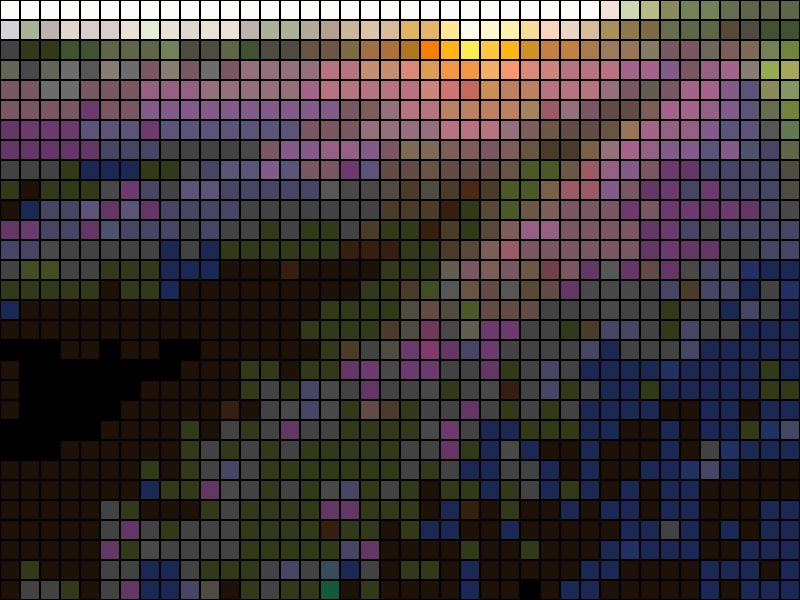

# Cross Stitch Generator

This desktop app was created using Go Fyne library. Run `go run cmd/main.go` to start app. Here is an example image followed by its cross stitched versions generated from app:

 

    

 

    
    
    

First, the app needs to know which image you want. This can be done by clicking "Select Folder" button and navigating through internal file explorer of one's local machine (image file types supported are `jpeg`/`jpg` or `png`). To resize image, one adjusts the "Height" slider and clicks "Resize" button; width is automatically determined based on image aspect ratio. One can adjust "Number of Color" slider to display the image as a grid using the specified amount of colors, which is accomplished by [color quantization](https://en.wikipedia.org/wiki/Color_quantization#:~:text=In%20computer%20graphics%2C%20color%20quantization,possible%20to%20the%20original%20image.). 

After clicking "Generate" button with an option selected in radio menu, a cross stitch board will display with the corresponding legend. The options are 

- *Filled color -* default option 
- *Filled color with symbols -* add symbols onto image to aid stitching the right color
- *X-stitch -* add visual appeal to default by replacing each cell as a cross stitch pattern

## Demos

The following will demonstrate the GUI accessibility via GIF below:

 

An output folder is created with images for each option shown in GUI

    

A user can always changes images within the program before generating.

    

One can change inputs in sliders before generating.

    

Any of the three options can be applied after each click on "Generate" button.

    

Note that the legend updates according to each cross stitch generation.